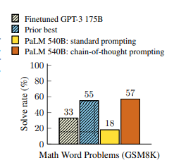
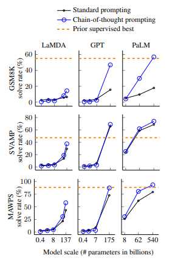
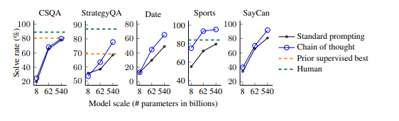
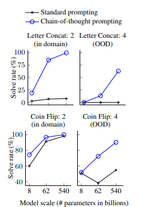
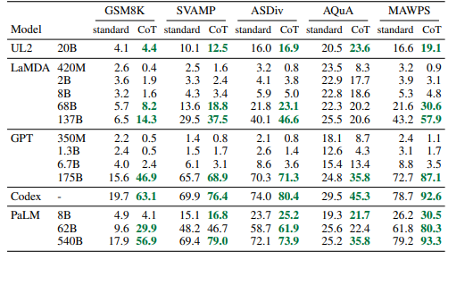

# Chain-of-Thought Prompting Elicits Reasoning in Large Language Models

## Overview

This documentation provides a critical summary of the drawbacks and limitations of **Chain-of-Thought (CoT) Prompting** as applied to Large Language Models (LLMs), based on recent research findings. Contrary to earlier claims that CoT prompting enables LLMs to learn general algorithmic reasoning skills, this paper argues that such benefits are limited, highly problem-specific, and do not generalize well. The increased need for human labor in crafting effective CoT prompts further diminishes their practical utility.

---

## Key Takeaways

- **Lack of Generalization:**  
  LLMs, when prompted with CoT examples, rarely generalize their reasoning out-of-distribution or to more complex problem instances. Effective CoT prompting almost always requires highly specific, carefully engineered examples.

- **Human Labor Cost:**  
  Creating effective CoT prompts demands significant human effort to design precise, correct reasoning traces for each problem class. This overhead can outweigh any performance gains, especially for large or diverse problem sets.

- **Narrow Utility “Sweet Spot”:**  
  - For **simple problems**, CoT adds little value (LLMs can solve them directly).
  - For **hard or generalized problems**, CoT improvements quickly deteriorate.
  - CoT is most effective only in a narrow “sweet spot” of moderate complexity with highly specific prompts.

- **Failure to Teach General Algorithms:**  
  Experimental evidence shows that CoT does not teach LLMs general solution procedures. Improvements are only observed when prompts closely match the queried problem in both structure and complexity.

- **Case Study & Broader Evaluation:**  
  - In Blocksworld (a classical planning domain), CoT only helps when prompt examples are nearly identical to the test case.
  - Scalable variants of other domains reveal similar failures: as problems depart from prompt specificity, model performance collapses.

---

## Detailed Findings

### 1. **Specificity over Generality**
> *“Meaningful performance improvements from chain of thought prompts are found only when those prompts are exceedingly specific…”*

- Example: Increasing the size of the stack in a Blocksworld problem beyond what was shown in the prompt leads to rapid performance decline.
- CoT’s effectiveness is tied to prompt engineering, not to a generalization of reasoning ability.

### 2. **Prompt Engineering Overhead**

- Each new problem class or complexity level requires new, hand-crafted CoT examples.
- For complex or varied tasks, the effort required to maintain effective CoT prompts becomes prohibitive.

### 3. **Scaling and Failure Modes**

- Attempts to scale CoT across problem domains (beyond Blocksworld) show consistent failure modes.
- Performance gains do not scale with increased problem complexity or diversity.

### 4. **Disarming the “Teaches Reasoning” Argument**

- The central claim—that CoT helps LLMs acquire general reasoning skills—is significantly weakened.
- CoT acts more as a crutch for solving narrowly defined problems than as a generalizable reasoning technique.

---

## Practical Implications

- **When to Use CoT:**  
  Use CoT only for narrowly defined tasks where specific solution traces can be easily engineered.
- **When to Avoid CoT:**  
  Avoid CoT for diverse, complex, or rapidly changing problem domains due to poor generalization and high labor costs.
- **Alternatives:**  
  Consider other approaches, such as architectural changes or fine-tuning, when generalizable reasoning is needed.

---
## Performance Evualations

- **Math Word Problems (GSM8K):**

  

- **Model Scale**

    

- **Common Scense Reasoning**

  

- **Symbolic Reasoning**

  


---
## Comparing Performance between Stand Prompting and CoT (Chain of Thought)

  

  Note that CoT prompting is an emergent ability of model scale, it does not positively impact performance
  until used with a model of sufficient scale.

  


---
## Conclusion

Chain-of-Thought prompting, while promising in initial demonstrations, is limited by its dependence on highly tailored prompts and its inability to teach LLMs generalizable reasoning procedures. Performance gains are fragile, non-scalable, and come at a significant human labor cost. The argument that CoT “teaches reasoning” is substantially undermined by these findings.

---

## Credit

This summary and critique is based on the original research paper:

**Chain-of-Thought Prompting Elicits Reasoning in Large Language Models**  
Jason Wei, Xuezhi Wang, Dale Schuurmans, Maarten Bosma, Brian Ichter, Fei Xia, Ed H. Chi, Quoc V. Le, Denny Zhou  
arXiv: [2201.11903](https://arxiv.org/abs/2201.11903)  
[PDF link](https://arxiv.org/pdf/2201.11903)

If you use ideas or results from this work, please cite accordingly:

```
@article{wei2022chain,
  title={Chain-of-Thought Prompting Elicits Reasoning in Large Language Models},
  author={Wei, Jason and Wang, Xuezhi and Schuurmans, Dale and Bosma, Maarten and Ichter, Brian and Xia, Fei and Chi, Ed H and Le, Quoc and Zhou, Denny},
  journal={arXiv preprint arXiv:2201.11903},
  year={2022}
}
```

*For further reading, see the original research paper and related literature on prompt engineering and LLM reasoning capabilities.*
